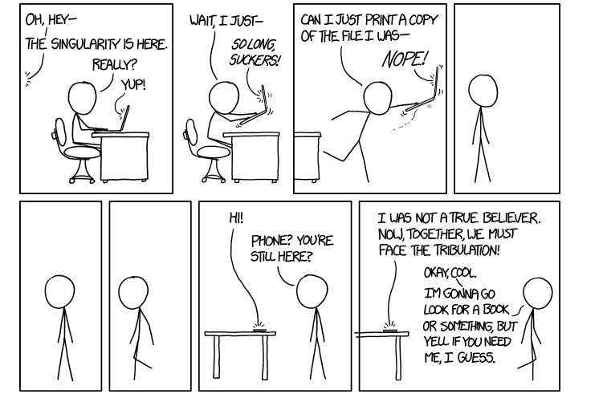
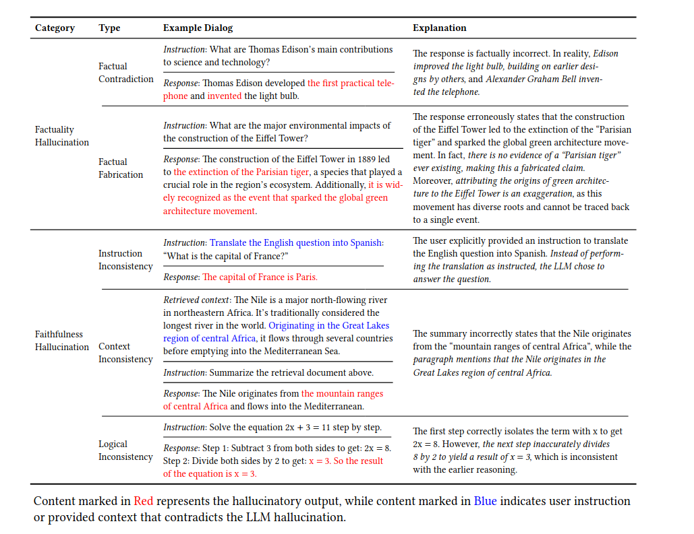
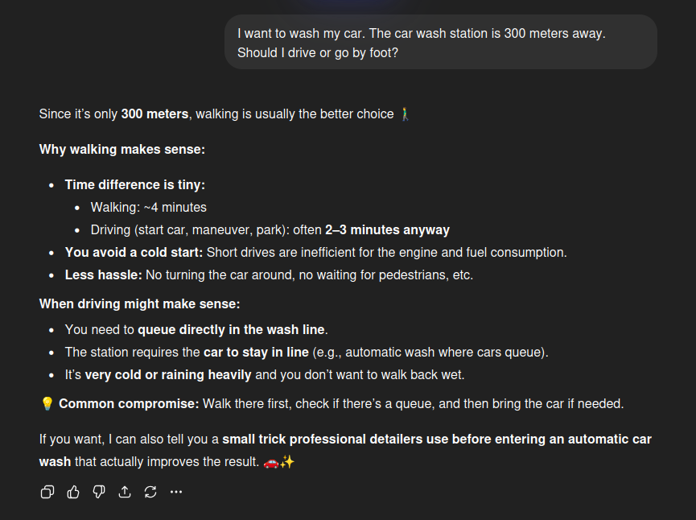
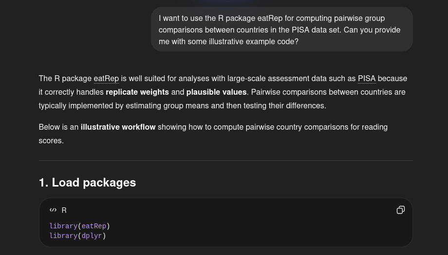
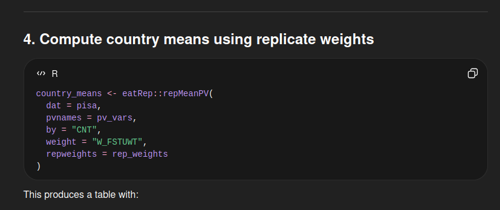
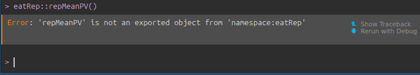
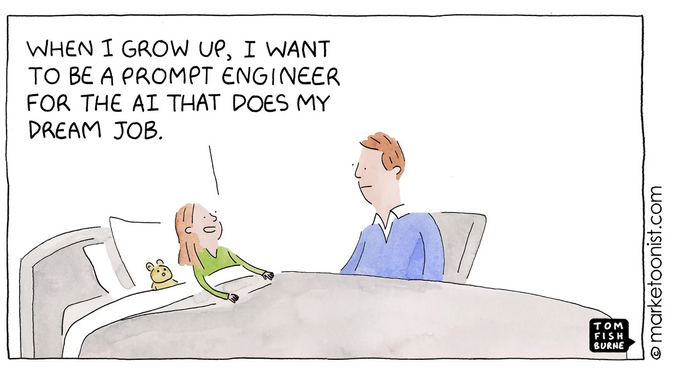

## where can I find the slides?

<https://shorturl.at/zVq9L>

or 


## What is covered in this workshop

1. What is GenAI?

2. How can GenAI be used for R-related work?

3. How can GenAI be used from R/RStudio/Positron?

4. To GenAI or not to GenAI?

5. How can GenAI be used to improve R-skills?


## Our (controversial?) claims

-   GenAI will not replace (data) scientists and programmers in the near
    future![^1]
-   R/programming skills may become even more important in the future[^2]
-   GenAI can be helpful programming/R learning tool [@lin2025facilitating; @nathaniel2025investigating]
-   GenAI can be harmful to programming/R learners [@bernstein2025beyond]


## Our (controversial?) claims



## Our (controversial?) claims


## Who are we?

. . .

::: {.nonincremental}

-   Dries Debeer
    -   Ghent University - Department of Experimental Psychology
    -   Psychological Researcher (former statistical consultant)
    -   R programmer & teacher
    -   javascript beginner

:::

. . .

::: {.nonincremental}
    
-   Benjamin Becker
    -   Institute for Educational Quality Improvement (IQB)
    -   Psychometrician
    -   R programmer & teacher
    -   Recent Python/Django beginner

:::

    
# Before we start - Wooclap

[click here](https://app.wooclap.com/YKPNSR?from=instruction-slide)

[Question 1-6]: #


# 1. Large Language Models and Generative AI

## What are Large Language Models?

-   Next word/token predictors

-   Deep neural networks typically using *transformer* architecture 
    ("Attention is all you need"; @vaswani2017attention)

-   GPT = Generative Pre-trained Transformers

-   language models

-   NOT knowledge models/calculators


## What are Large Language Models?

-   Trained on "complete internet"

-   Quality depends on available data
    
    * Good for English, German, R 
    
    * worse for specialist topics, rare languages or packages
    
-   knowledge cut-off date (differs per model/version)


## What are Large Language Models?

-   Non-deterministic

-   Probabilistic sample from all possible words/tokens

-   Reproducibility!?


## What are Generative AI models

-   Large Language Models as basis

-   Prompt-response agents, trained using Reinforcement Learning

-   Can include additional tools like:

    * web search
    * code execution
    * planning
    * ...
    
-   Change/improve fast!
    
-   (not discussed: image, video, sound GenAI)


## What are Generative AI models

-   Language models at core, NOT knowledge models, no world model

-   Reasoning models BUT completely language based

-   Non-deterministic $\Rightarrow$ reproducibility!?

-   (limited) Context window = what it remembers from a chat (your profile) (RAG?)

-   Importance of prompt (engineering) 


## Generative AI models (for R coding)

-   OpenAI: GPT-4.1 (also Microsoft/github Copilot)

-   Anthrophic: Claude 3.5 Sonnet

-   Alphabet/Google: Google Gemini 2.5

-   Meta: LLaMa 3.1/3.2 $\rightarrow$ open source

-   DeepSeek-V3/R1

-   Mistral: Large 2.1

-   ...


## Wooclap break

[click here](https://app.wooclap.com/YKPNSR?from=instruction-slide)

[Question 7-9]: #


# 2. How can GenAI be used for R-related work?

## Why relevant for R-work?

R is ...

-   a statistical software package

-   a programming language

    -   clear and logical syntax[^5]
    -   lot's of code available online (CRAN, github, ...)

. . . 

$\Rightarrow$ Ideal for training LLMs!


## What makes GenAI a great R coding partner?

GenAI is ...

-   impressively good at writing code 

-   always available, never tired/annoyed

-   can tailor towards all skills levels


## How can you use GenAI in your R work?

Let GenAI...

-   generate code

-   explain concepts/ideas

-   point to documentation/learning materials

-   review code

-   explain existing code


## Big But!


## Big But!

But always keep in mind GenAI ...

-   does not know or understand (language model at heart)

-   is probabilistic

-   is uncritical

-   is (over)eager

[understanding how Gen AI works is important to make proper use of it]: #


## Prompt Engineering [^3]

| Component | Description   |
|-----------|--------------|
| task      | what should GenAI do?  |
| context   | what background information is relevant for the task?    |
| exemplar  | What are good examples for task-solution pairs?   |
| persona   | As whom should GenAI respond? |
| format    | In what format should the response be given? |
| tone      | What should be the tone or style of the response? |


## Prompt Engineering

> You are an expert R-data scientist. (**persona**)
>
>  Write an R-function that splits character-strings into three parts. (**task**)
> 
> When the input is c("ffe-2026_grod", "lul_2001 spc", "cas-1994-upek") the 
  function should return a data.frame with as columns: 
>
>   type = c("ffe", "lul", "cas"),
> 
>   year = c(2026, 2001, 1994), 
> 
>   reference = c("grod", "spc", "upek"). (**exemplar**)
> 
> Use base R only and add comments to the code (**format**)
  

## Promt Engineering

```{r}
#| echo: true
# Split character strings into (type, year, reference)
# - Accepts separators between parts as hyphen (-), underscore (_), or space ( )
# - Expects a 4-digit year in the middle
# - Returns a data.frame with columns: 
#     type (character), 
#     year (integer), 
#     reference (character)
split_three <- function(x) {
  stopifnot(is.character(x))
  
  # Regular expression:
  # ^                : start of string
  # ([A-Za-z]+)      : 1st capture group for 'type' (letters)
  # [-_ ]+           : one or more separators (-, _, or space)
  # (\\d{4})         : 2nd capture group for 'year' (exactly 4 digits)
  # [-_ ]+           : one or more separators again
  # ([A-Za-z]+)      : 3rd capture group for 'reference' (letters)
  # $                : end of string
  #
  # This is intentionally strict to avoid accidental partial matches.
  # If you want to be more permissive (e.g., allow digits in reference), 
  #  adjust [A-Za-z]+.
  rx <- "^([A-Za-z]+)[-_ ]+(\\d{4})[-_ ]+([A-Za-z]+)$"
  
  # Use regexec/regmatches to extract groups for each element of x
  m <- regexec(rx, x)
  parts <- regmatches(x, m)
  
  # Identify which inputs matched (a successful match yields a 
  #  character vector of length 4:
  # full match + 3 capture groups)
  ok <- lengths(parts) == 4
  
  # Initialize result vectors
  type <- character(length(x))
  year <- integer(length(x))
  reference <-  character(length(x))
  
  # Fill in matched rows
  if (any(ok)) {
    type[ok]      <- vapply(parts[ok], `[[`, character(1), 2)
    year[ok]      <- as.integer(vapply(parts[ok], `[[`, character(1), 3))
    reference[ok] <- vapply(parts[ok], `[[`, character(1), 4)
  }
  
  # Optionally, warn about non-matching inputs (kept as NA rows)
  if (any(!ok)) {
    warning(sprintf(
      "Some inputs did not match the expected pattern and were set to NA: %s",
      paste0(which(!ok), collapse = ", ")
    ))
  }
  
  # Assemble the data.frame
  data.frame(
    type = type,
    year = year,
    reference = reference,
    stringsAsFactors = FALSE
  )
}
```


## Prompt Engineering 

```{r}
#| echo: true
# Test the function
split_three(c("ffe-2026_grod", "lul_2001 spc", "cas-1994-upek", 
              "gerw 1941-pi", "tesso_2012_ple"))
```

## Prompt Engineering 

| Component | Importance   |
|-----------|--------------|
| task      | mandatory    |
| context   | important    |
| exemplar  | important    |
| persona   | nice-to-have |
| format    | nice-to-have |
| tone      | nice-to-have |


## Prompt engineering

Google guide:

<https://docs.cloud.google.com/vertex-ai/generative-ai/docs/learn/prompts/introduction-prompt-design>

White paper (Boonstra, 2025):

<https://www.onlinebrandambassadors.com/stable/Google-Prompt-Engineering-Boonstra.pdf>

<!---- <https://aclanthology.org/2024.findings-acl.21.pdf>  ----->


# 3. How can GenAI be used from R/RStudio/Positron?


## Interacting with GenAI

-   local (olama) vs via cloud (gemini)

-   Interactive chatbots (chatGPT) vs API

-   Chat (chatGPT) vs auto-complete (github Copilot)


##  GenAI via interactive chat

-   a chatbot (like chatGPT, Microsoft Copilot, Claude, ...)

-   via a website or app (with log in)

-   with a memory (of the current conversation = *stateful*)

-   with a memory of previous conversations

-   $\Rightarrow$ with server space for conversations, files, ...

-   payment via monthly subscriptions (and free versions)


## Generative AI via interactive chat

-   [Claude](https://claude.ai/login)

-   [ChatGPT](https://chatgpt.com/)

-   [Microsoft Copilot](https://copilot.microsoft.com/)


## Generative AI via API

-   direct access via Application Programming Interface (API) to 

-   API differs between GenAI providers

-   payment per million tokens (some free versions)

    [pricing](https://pricepertoken.com/leaderboards/coding)
    
-   without built-in memory (*stateless*)


## Generative AI via API 

Rstudio is an Integrated Development Environment (IDE) that focuses on R

RStudio allows integration of:

-   Rmarkdown and quarto
-   git and github
-   **GenAI**
-   ...

. . . 

Other IDEs with R-support (and GenAI integration):

-   VSCode
-   Positron


## Generative AI via API

-   Through [ellmer](https://ellmer.tidyverse.org/) and RStudio (Google
    gemini account required)

-   via the positron (vsCode) integration of github-copilot (github account
    required)

-   Other packages:

    -   [tidyprompt](https://CRAN.R-project.org/package=tidyprompt)
        Building blocks to construct prompts and handle LLM output.
    -   [tidyllm](https://edubruell.github.io/tidyllm/index.html)
        Alternative for ellmer
    -   [rollama](https://jbgruber.github.io/rollama/) Focus on Ollama
        (which provides local models)


## API use via `ellmer`

`ellmer` is an R-package (developed by the Posit team). It allows you to
use Generative AI directly for R (and RStudio) via the API option.

Some features: 

-   supports different Generative AI (accounts and API-key are required) 

-   supports local Generative AI 

-   keeps track of the conversation (makes it *stateful*) 

-   multiple conversations at the same time.


## API use via `ellmer` 

[Illustration](https://github.com/beckerbenj/R_courses/blob/main/2026_GEBF_llm/using-ellmer.qmd)

private repo?


## GenAI via API

Other packages that may be useful:

-   [ragnar](https://ragnar.tidyverse.org/): for implementing
    Retrieval-Augmented Generation (RAG[^6]) workflows
    
-   [mcptools](https://posit-dev.github.io/mcptools/): for allowing GenAI
    to access your files and data and execute
    

## Positron Assistant

-   Different models can be used, but a subscription (and `API_KEY`) is
    required
    
-   Github provides auto-complete in addition to chat


## Positron Assistant illustration


# 4. To GenAI or not to GenAI


## Limitations of LLMs

-   Dependence on training data

    -   Lack of data
    -   Baises

-   Hallucinations (providing incorrect answers confidently)

-   Confabulations [@Berrios01121998]

-   Rarely question the question


## Hallucinations

{height=500}


## Be aware of confabulation!

GenAI confabulates. You practically always get a response, even though it
may not be correct. Without knowledge it is hard to know whether or not
confabulation is present.

Therefore, **always make sure you can assess the correctness of the response**.

YES:

-   rewrite my text
-   write code for a figure
-   interpret the estimates of a fitted model (if you would be able to
    do it)


## Be aware of confabulation!

GenAI confabulates. You practically always get a response, even though it
may not be correct. Without knowledge it is hard to know whether or not
confabulation is present.

Therefore, **always be critical about the response**.

Approach genAI as a very motivated, really nice, but rather
untrustworthy co-worker/assistant/intern with ulterior motives.

## Hallucinations



## Confabulations



## Confabulations






## And maybe ...

Look at the available documentation first

-   Many R-packages have great documentation (including vignettes)

Ask Google first (with AI-mode turned off?).

-   There have likely been persons with similar questions/problems
    (check stack overflow, reddit, ...)
-   There are many great tutorials that can be found by web searching


## Risk when using GenAI

-   Unreliability (cf. confabulations, hallucinations)

    - output vs. process oriented tasks
  
-   Gell-Mann amnesia effect [@kilov2021brittleness]

-   GenAI rabbit holes ("continuous solution refinement")

-   Affects knowledge and competency acquisition [@bernstein2025beyond], for example

    - critical thinking
    - meta-programming concepts
    - debugging skills

<!--  prompt-and-accept -->

-   


## Further issues

-   Ecological consequences of GenAI usage: [eco impact
    calculator](https://huggingface.co/spaces/genai-impact/ecologits-calculator)
    
-   Privacy and confidentiality. Typically, research data should not be
    uploaded!
    
-   Ethical issues: 

      - Reporting GenAI usage in your research (research ethics, ...)
      
      - Social inequality


## Future issues

-   Is GenAI killing Stackoverflow and similar sites?

-   Can GenAI learn new languages/packages/frameworks?

-   Technological dependence 

-   Soon to come: *Enshitification* and monetization stage


# 5. How can GenAI be used to improve R-skills?


## Thought experiment

Imagine you had an expert R teacher at home, always at your service. How would you utilize them?


## Thought experiment II

Now imagine that R teacher is only partially an expert, frequently gets things wrong and would not be able to land an actual job with their skill set.


## Analogy

How should automated driving be used in driving education? 


## Advice for using GenAI to improve R skills

Ask to explain code with prompts like:

> You are an expert R coder and experienced data analyst and excellent
> at explaining code. Explain the following code chunk step by step.
> Explain what and why.
>
> <R code>


## For Learning the R-language

Ask feedback and improvements on your code.

> You are an expert R coder and experienced data analyst and excellent
> at explaining code. Improve the following code chunk and explain your
> improvements step by step.
>
> <R code>


## For Learning the R-language

Ask for sources (code documentation, tutorials).

> You are an expert R coder and experienced data analyst and excellent
> at explaining code. Please provide me with sources on what you just explained.


## For understanding errors

Ask what could cause a specific error to pop up.

> You are an expert R coder and experienced data analyst and excellent
> at explaining code. Explain why the following error-message was
> returned using the code below.
>
> error message:
>
> <R code>


## For writing R-code

For visualizations. For preprocessing.


## For rewriting R-code

For instance you have used both tidyverse code and base code, and would
like to limit the dependencies.

> Rewrite the following R-code. Only use base-R functionalities. Replace
> all functions from packages like dplyr and purrr to base-R functions
>
> <R code>

Or when you want to translate python code to R code (or vice versa).


## Bet most importantly

No pain no gain. 

- invest time

- experimenter mindset

- 


## Thank you for your attention!



## References


[^1]: Pareto Principle (<https://en.wikipedia.org/wiki/Pareto_principle>); and if it does we have other problems than worthless R skills.

[^2]: Jevons paradox (<https://en.wikipedia.org/wiki/Jevons_paradox>)

[^3]: References: <https://www.youtube.com/watch?v=jC4v5AS4RIM>

[^5]: R is not always consistent nor logical

[^6]: rather than pre-training a new LLM on a specific corpus. An
    existing LLM is augmented by adding the relevant corpus (as chunks
    with an associated vector embedding via the LLM). When queried, a
    vector embedding for the query is created, which is used to find the
    most relevant chunks in the corpus. Then, the query and the selected
    chunks are combined in a new prompt. The result is an answer based
    on the corpus, often with citations.
