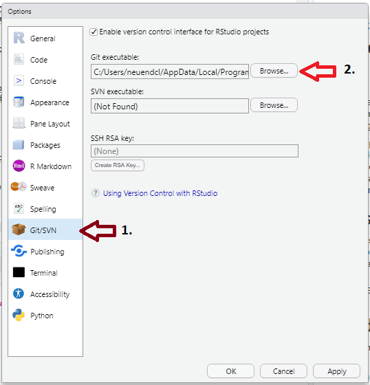

<style type="text/css">
  body{
  font-size: 14pt;
}
</style>

Folgende Schritte solltet ihr **vor** der Teilnahme am Workshop ausgeführt haben.

### 1. [Github](https://github.com) Profil anlegen

Beim Anlegen des Accounts ist zu beachten, dass dieser Username der Name ist, unter dem ihr und euer Code gefunden werden könnt. Hinweise für die Entscheidung für einen Nutzernamen finden sich auch bei [Jennifer Bryan](https://happygitwithr.com/github-acct.html).

### 2. Git installieren

Um Git zu installieren, nutzt folgenden Link: [https://git-scm.com/download/win](https://git-scm.com/download/win). Für die Installation sind keine Admin-Rechte nötig. Es ist jedoch wichtig, dass ihr euch merkt, bzw. herausbekommt, in welchem Ordner Git dann abgelegt ist. Bei mir ist das zum Beispiel: 

> C:/Users/hu-accountname/AppData/Local/Programs/Git/bin

### 3. R und RStudio installieren

Vermutlich habt ihr R und RStudio bereits auf eurem Computer. Falls nicht, hier die Links: 

* [R](https://ftp.fau.de/cran/) 
* [RStudio](https://www.rstudio.com/products/rstudio/download/#download)

### 4. Git-Pfad bei R-Studio hinterlegen

Nun müssen wir RStudio mitteilen, wo Git gefunden werden kann. Dies geben wir unter Tools --> Global Options an.



### 5. Git sagen, wer ihr seid

Als nächstes müssen wir Git sagen, welches unser Username auf Github ist. Das funktioniert am einfachsten direkt in R mit folgendem Code:

```{r eval = F}

# falls notwendig, das Paket usethis installieren
# install.packages("usethis")

library(usethis)
use_git_config(user.name = "Username", user.email = "user@iqb.hu-berlin.de")
```

Es ist aber auch möglich, dies direkt in der "Shell" zu tun, mit dem Befehl: 

> git config --global user.name "Username"
> git config --global user.email "user@iqb.hu-berlin.de"

und so könnt ihr prüfen, ob alles funktioniert hat:

> git config --global --list

### 6. Unserem Beispiel-Repositorium beitreten

Öffnet das Beispielrepositorium auf GitHub: [https://github.com/ClaudiaNdf/git_workshop](https://github.com/ClaudiaNdf/git_workshop)

Erstellt ein neues "Issue", schreibt euren Namen hinein und dass ich euch als Editor aufnehmen soll.

### 7. Workshop

Ihr seid nun bereit für unseren Git-Workshop! Falls ihr Probleme mit dem Setup oder Fragen habt, meldet euch gerne bei uns. Wir freuen uns auf den Workshop mit Euch!
